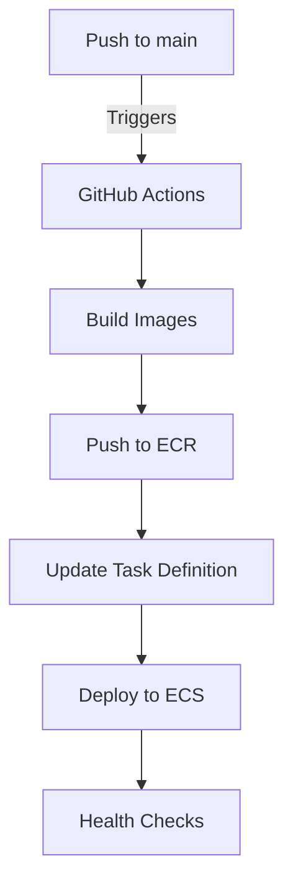
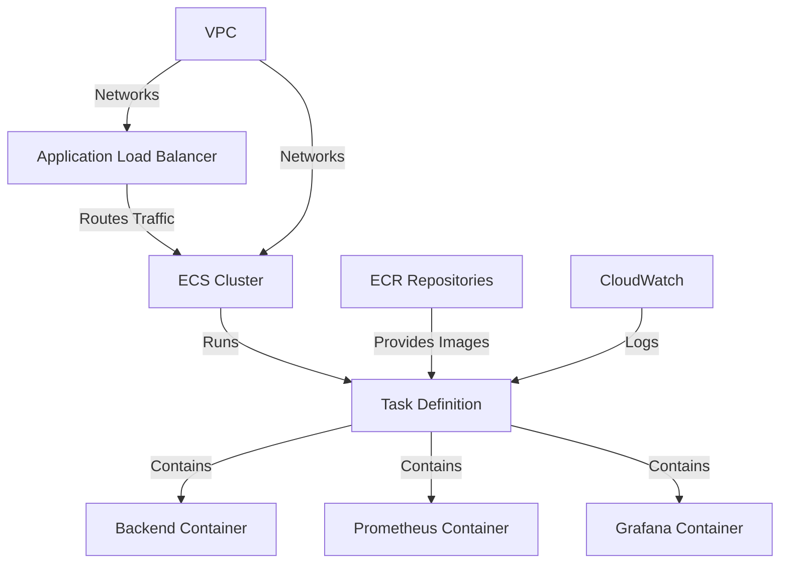

# Terraform Deployment Guide

## Overview

This directory contains the Terraform configuration for deploying the monitoring stack on AWS ECS Fargate. The stack consists of:

- Django Backend API
- Prometheus Monitoring
- Grafana Dashboards

The infrastructure is designed to be:
- Highly available across multiple AZs
- Cost-effective using Fargate
- Auto-scalable based on demand
- Secure with proper network isolation

## Deployment Methods

Choose one of these deployment methods:

### 1. GitHub Actions (Recommended) 
- Automated CI/CD pipeline
- Production-ready deployments
- Consistent and traceable
- Integrated testing and validation

### 2. Manual Terraform (Development)
- Local testing and development
- Infrastructure experimentation
- Emergency interventions
- Learning purposes

### GitHub Actions Deployment (Primary Method)

The main deployment process is automated through GitHub Actions. Every push to the main branch triggers the deployment pipeline.

#### Workflow Overview



#### GitHub Actions Workflow

```yaml
name: Deploy to AWS ECS
on:
  push:
    branches: [main]
  pull_request:
    branches: [main]

env:
  AWS_REGION: us-east-1
  ECR_REPOSITORY_BACKEND: monitoring/backend
  ECR_REPOSITORY_PROMETHEUS: monitoring/prometheus
  ECR_REPOSITORY_GRAFANA: monitoring/grafana
  ECS_CLUSTER: monitoring-cluster
  ECS_SERVICE: monitoring-service

jobs:
  deploy:
    runs-on: ubuntu-latest
    steps:
      - name: Checkout code
        uses: actions/checkout@v3

      - name: Configure AWS credentials
        uses: aws-actions/configure-aws-credentials@v2
        with:
          aws-access-key-id: ${{ secrets.AWS_ACCESS_KEY_ID }}
          aws-secret-access-key: ${{ secrets.AWS_SECRET_ACCESS_KEY }}
          aws-region: ${{ env.AWS_REGION }}

      - name: Login to Amazon ECR
        id: login-ecr
        uses: aws-actions/amazon-ecr-login@v1

      - name: Build and push Backend image
        uses: docker/build-push-action@v4
        with:
          context: ./backend
          push: true
          tags: ${{ steps.login-ecr.outputs.registry }}/${{ env.ECR_REPOSITORY_BACKEND }}:${{ github.sha }}

      - name: Build and push Prometheus image
        uses: docker/build-push-action@v4
        with:
          context: ./monitoring
          file: ./monitoring/Dockerfile
          push: true
          tags: ${{ steps.login-ecr.outputs.registry }}/${{ env.ECR_REPOSITORY_PROMETHEUS }}:${{ github.sha }}

      - name: Build and push Grafana image
        uses: docker/build-push-action@v4
        with:
          context: ./monitoring/grafana
          file: ./monitoring/grafana/Dockerfile
          push: true
          tags: ${{ steps.login-ecr.outputs.registry }}/${{ env.ECR_REPOSITORY_GRAFANA }}:${{ github.sha }}

      - name: Setup Terraform
        uses: hashicorp/setup-terraform@v2
        with:
          terraform_version: 1.0.0

      - name: Terraform Init
        working-directory: ./deployment/terraform
        run: terraform init

      - name: Terraform Plan
        working-directory: ./deployment/terraform
        run: terraform plan -out=tfplan
        env:
          TF_VAR_backend_image: ${{ steps.login-ecr.outputs.registry }}/${{ env.ECR_REPOSITORY_BACKEND }}:${{ github.sha }}
          TF_VAR_prometheus_image: ${{ steps.login-ecr.outputs.registry }}/${{ env.ECR_REPOSITORY_PROMETHEUS }}:${{ github.sha }}
          TF_VAR_grafana_image: ${{ steps.login-ecr.outputs.registry }}/${{ env.ECR_REPOSITORY_GRAFANA }}:${{ github.sha }}

      - name: Terraform Apply
        if: github.ref == 'refs/heads/main'
        working-directory: ./deployment/terraform
        run: terraform apply -auto-approve tfplan

      - name: Wait for ECS Service Stability
        if: github.ref == 'refs/heads/main'
        run: |
          aws ecs wait services-stable \
            --cluster ${{ env.ECS_CLUSTER }} \
            --services ${{ env.ECS_SERVICE }}

      - name: Health Check
        if: github.ref == 'refs/heads/main'
        run: |
          curl --fail --retry 5 \
            --retry-delay 10 \
            --retry-connrefused \
            http://${{ steps.tf-output.outputs.alb_dns }}/api/health/
```

#### Required Secrets

Configure these secrets in your GitHub repository:
- `AWS_ACCESS_KEY_ID`: AWS access key
- `AWS_SECRET_ACCESS_KEY`: AWS secret key
- `AWS_REGION`: region used for deployment
- `ECR_REPOSITORY`: name of the ECR repository in AWS
- `ECS_CLUSTER_NAME`: name of the cluster in AWS
- `ECS_SERVICE_NAME`: name of the service in AWS
- `API_TOKEN`: Token generated to authenticate the user in the backend api
- `DJANGO_SECRET_KEY`: secret key generated for django

#### Deployment Process

1. **Trigger**:
   - Push to main branch
   - Pull request to main branch (plan only)

2. **Build Phase**:
   - Builds Docker images for all services
   - Tags images with commit SHA
   - Pushes images to ECR

3. **Infrastructure Phase**:
   - Initializes Terraform
   - Plans infrastructure changes
   - Applies changes (main branch only)

4. **Validation Phase**:
   - Waits for ECS service stability
   - Performs health checks
   - Verifies deployment success

#### Monitoring Deployments

1. **GitHub Actions Dashboard**:
   - View workflow status
   - Check build logs
   - Monitor deployment progress

2. **AWS Console**:
   - ECS cluster status
   - Task definition versions
   - Service health

3. **CloudWatch Logs**:
   - Container logs
   - Deployment events
   - Error tracking

### Manual Terraform Deployment (Alternative)

The following sections describe the manual deployment process, which should only be used for:
- Local development
- Testing infrastructure changes
- Emergency manual interventions
- Learning and understanding the infrastructure

 **Important**: Always prefer the GitHub Actions workflow for production deployments to ensure consistency and traceability.

## Infrastructure Components



## Prerequisites

1. **AWS CLI Configuration**
   ```bash
   aws configure
   ```

2. **Required Tools**
   - Terraform >= 1.0.0
   - AWS CLI >= 2.0.0
   - Docker

3. **AWS Permissions**
   - ECS Full Access
   - ECR Full Access
   - CloudWatch Full Access
   - Load Balancer Full Access
   - VPC Full Access
   - IAM Limited Access

## Deployment Steps

### Quick Start Guide

1. **Initialize Terraform**
   ```bash
   terraform init
   ```

2. **Configure Environment**
   Create `terraform.tfvars`:
   ```hcl
   # Infrastructure Settings
   environment         = "production"
   aws_region         = "us-east-1"
   vpc_cidr           = "10.0.0.0/16"
   availability_zones = ["us-east-1a", "us-east-1b"]

   # Container Resources
   container_port     = 8000
   container_cpu      = 256  # 0.25 vCPU
   container_memory   = 512  # MB

   # Application Settings
   app_name          = "monitoring"
   django_debug      = false
   django_allowed_hosts = "*"
   ```

3. **Preview Changes**
   ```bash
   terraform plan -out tfplan
   ```

4. **Deploy Infrastructure**
   ```bash
   terraform apply tfplan
   ```

5. **Verify Deployment**
   ```bash
   # Check ECS service status
   aws ecs describe-services \
     --cluster monitoring-cluster \
     --services monitoring-service

   # Test backend health
   curl http://<load-balancer-dns>:8000/api/health/
   ```

## Infrastructure Details

### VPC Configuration
- **CIDR Block**: 10.0.0.0/16
- **Subnets**: 
  - Public (2 AZs)
  - Private (2 AZs)
- **NAT Gateway**: For private subnet access

### ECS Cluster
- **Launch Type**: FARGATE
- **Network Mode**: awsvpc
- **Task Definition**:
  ```json
  {
    "containerDefinitions": [
      {
        "name": "backend",
        "image": "${aws_account}.dkr.ecr.${region}.amazonaws.com/monitoring/backend:latest",
        "cpu": 256,
        "memory": 512,
        "essential": true
      },
      {
        "name": "prometheus",
        "image": "${aws_account}.dkr.ecr.${region}.amazonaws.com/monitoring/prometheus:latest",
        "cpu": 256,
        "memory": 512,
        "essential": true
      },
      {
        "name": "grafana",
        "image": "${aws_account}.dkr.ecr.${region}.amazonaws.com/monitoring/grafana:latest",
        "cpu": 256,
        "memory": 512,
        "essential": true
      }
    ]
  }
  ```

### Load Balancer
- **Type**: Application Load Balancer
- **Listeners**:
  - Port 80 (HTTP)
  - Port 8000 (Backend API)
  - Port 9090 (Prometheus)
  - Port 3000 (Grafana)

### Security Groups
- **ALB Security Group**:
  - Inbound: 80, 8000, 9090, 3000
  - Outbound: All

- **ECS Security Group**:
  - Inbound: From ALB
  - Outbound: All

## Accessing the Applications

After deployment, you can access the applications using the following steps:

1. **Get the Load Balancer DNS Name**:
   ```bash
   aws elbv2 describe-load-balancers --names monitoring-alb --query 'LoadBalancers[0].DNSName' --output text
   ```

2. **Application URLs**:
   - Backend API: `http://<load-balancer-dns>:8000`
   - Prometheus: `http://<load-balancer-dns>:9090`
   - Grafana: `http://<load-balancer-dns>:3000`

3. **Important Endpoints**:
   - Backend API:
     - Health Check: `/api/health/`
     - Metrics: `/api/metrics/`
     - Status: `/api/status/`
   
   - Prometheus:
     - UI: `/`
     - Health Check: `/-/healthy`
     - Targets: `/targets`
   
   - Grafana:
     - Login: `/login` (default credentials: admin/admin)
     - Dashboards: `/dashboards`
     - Health Check: `/api/health`

4. **Health Check Command**:
   ```bash
   # Replace <load-balancer-dns> with the actual DNS name
   curl -f http://<load-balancer-dns>:8000/api/health/
   ```

**Note**: 
- After deployment, it might take a few minutes for the DNS to propagate and services to become available
- If you can't access the services, verify:
  1. Security group rules are properly configured
  2. Services are running in ECS
  3. Health checks are passing
  4. DNS propagation is complete

## Monitoring & Logging

### CloudWatch Configuration
- **Log Retention**: 30 days
- **Log Groups**:
  - `/ecs/monitoring/backend`
  - `/ecs/monitoring/prometheus`
  - `/ecs/monitoring/grafana`

### Container Insights
- **Metrics Collection**: Enabled
- **Performance Monitoring**: Enabled
- **Custom Metrics**: Configured

## Management Commands

### Update Task Definition
```bash
terraform taint aws_ecs_task_definition.monitoring
terraform plan -out tfplan
terraform apply tfplan
```

### Scale Service
```bash
# Update desired_count in variables.tf
terraform plan -out tfplan
terraform apply tfplan
```

### Update Container Images
```bash
# Update image tags in variables.tf
terraform apply -target=aws_ecs_task_definition.monitoring
```

## Security Considerations

1. **Network Security**
   - Private subnets for containers
   - Security group restrictions
   - HTTPS recommended for production

2. **IAM Roles**
   - Task execution role
   - Task role for service permissions
   - Least privilege principle

3. **Secrets Management**
   - AWS Secrets Manager integration
   - Environment variable encryption
   - Secure parameter storage

## Cost Optimization

1. **Fargate Spot**
   - Enable for non-critical workloads
   - Set capacity provider strategy

2. **Auto Scaling**
   - Based on CPU/Memory utilization
   - Schedule-based scaling for known patterns

3. **Resource Allocation**
   - Right-size container resources
   - Monitor and adjust based on usage

## Continuous Integration

The following sections describe ongoing integration and maintenance tasks for both deployment methods.

```yaml
name: Deploy to AWS ECS
on:
  push:
    branches: [main]
  pull_request:
    branches: [main]

env:
  AWS_REGION: us-east-1
  ECR_REPOSITORY_BACKEND: monitoring/backend
  ECR_REPOSITORY_PROMETHEUS: monitoring/prometheus
  ECR_REPOSITORY_GRAFANA: monitoring/grafana
  ECS_CLUSTER: monitoring-cluster
  ECS_SERVICE: monitoring-service

jobs:
  deploy:
    runs-on: ubuntu-latest
    steps:
      - name: Checkout code
        uses: actions/checkout@v3

      - name: Configure AWS credentials
        uses: aws-actions/configure-aws-credentials@v2
        with:
          aws-access-key-id: ${{ secrets.AWS_ACCESS_KEY_ID }}
          aws-secret-access-key: ${{ secrets.AWS_SECRET_ACCESS_KEY }}
          aws-region: ${{ env.AWS_REGION }}

      - name: Login to Amazon ECR
        id: login-ecr
        uses: aws-actions/amazon-ecr-login@v1

      - name: Build and push Backend image
        uses: docker/build-push-action@v4
        with:
          context: ./backend
          push: true
          tags: ${{ steps.login-ecr.outputs.registry }}/${{ env.ECR_REPOSITORY_BACKEND }}:${{ github.sha }}

      - name: Build and push Prometheus image
        uses: docker/build-push-action@v4
        with:
          context: ./monitoring
          file: ./monitoring/Dockerfile
          push: true
          tags: ${{ steps.login-ecr.outputs.registry }}/${{ env.ECR_REPOSITORY_PROMETHEUS }}:${{ github.sha }}

      - name: Build and push Grafana image
        uses: docker/build-push-action@v4
        with:
          context: ./monitoring/grafana
          file: ./monitoring/grafana/Dockerfile
          push: true
          tags: ${{ steps.login-ecr.outputs.registry }}/${{ env.ECR_REPOSITORY_GRAFANA }}:${{ github.sha }}

      - name: Setup Terraform
        uses: hashicorp/setup-terraform@v2
        with:
          terraform_version: 1.0.0

      - name: Terraform Init
        working-directory: ./deployment/terraform
        run: terraform init

      - name: Terraform Plan
        working-directory: ./deployment/terraform
        run: terraform plan -out=tfplan
        env:
          TF_VAR_backend_image: ${{ steps.login-ecr.outputs.registry }}/${{ env.ECR_REPOSITORY_BACKEND }}:${{ github.sha }}
          TF_VAR_prometheus_image: ${{ steps.login-ecr.outputs.registry }}/${{ env.ECR_REPOSITORY_PROMETHEUS }}:${{ github.sha }}
          TF_VAR_grafana_image: ${{ steps.login-ecr.outputs.registry }}/${{ env.ECR_REPOSITORY_GRAFANA }}:${{ github.sha }}

      - name: Terraform Apply
        if: github.ref == 'refs/heads/main'
        working-directory: ./deployment/terraform
        run: terraform apply -auto-approve tfplan

      - name: Wait for ECS Service Stability
        if: github.ref == 'refs/heads/main'
        run: |
          aws ecs wait services-stable \
            --cluster ${{ env.ECS_CLUSTER }} \
            --services ${{ env.ECS_SERVICE }}

      - name: Health Check
        if: github.ref == 'refs/heads/main'
        run: |
          curl --fail --retry 5 \
            --retry-delay 10 \
            --retry-connrefused \
            http://${{ steps.tf-output.outputs.alb_dns }}/api/health/
```

#### Required Secrets

Configure these secrets in your GitHub repository:
- `AWS_ACCESS_KEY_ID`: AWS access key
- `AWS_SECRET_ACCESS_KEY`: AWS secret key

#### Deployment Process

1. **Trigger**:
   - Push to main branch
   - Pull request to main branch (plan only)

2. **Build Phase**:
   - Builds Docker images for all services
   - Tags images with commit SHA
   - Pushes images to ECR

3. **Infrastructure Phase**:
   - Initializes Terraform
   - Plans infrastructure changes
   - Applies changes (main branch only)

4. **Validation Phase**:
   - Waits for ECS service stability
   - Performs health checks
   - Verifies deployment success

#### Monitoring Deployments

1. **GitHub Actions Dashboard**:
   - View workflow status
   - Check build logs
   - Monitor deployment progress

2. **AWS Console**:
   - ECS cluster status
   - Task definition versions
   - Service health

3. **CloudWatch Logs**:
   - Container logs
   - Deployment events
   - Error tracking

### Manual Deployment (Alternative)

The steps outlined in the previous sections for manual Terraform deployment should only be used for:
- Local development
- Testing infrastructure changes
- Emergency manual interventions
- Learning and understanding the infrastructure

**Important**: Always prefer the GitHub Actions workflow for production deployments to ensure consistency and traceability.

## Clean Up

To destroy all resources:
```bash
terraform destroy
```

**Warning**: This will remove all resources. Ensure you have backups if needed.

## Troubleshooting

### Common Issues

1. **Task Failed to Start**
   - Check CloudWatch logs
   - Verify task execution role
   - Confirm container configuration

2. **Connection Issues**
   - Verify security group rules
   - Check route table configuration
   - Validate health check settings

3. **Deployment Failures**
   - Review terraform plan output
   - Check AWS service quotas
   - Verify resource availability

## Additional Resources

1. [AWS ECS Documentation](https://docs.aws.amazon.com/ecs)
2. [Terraform AWS Provider](https://registry.terraform.io/providers/hashicorp/aws)
3. [ECS Best Practices](https://docs.aws.amazon.com/AmazonECS/latest/bestpracticesguide/)
