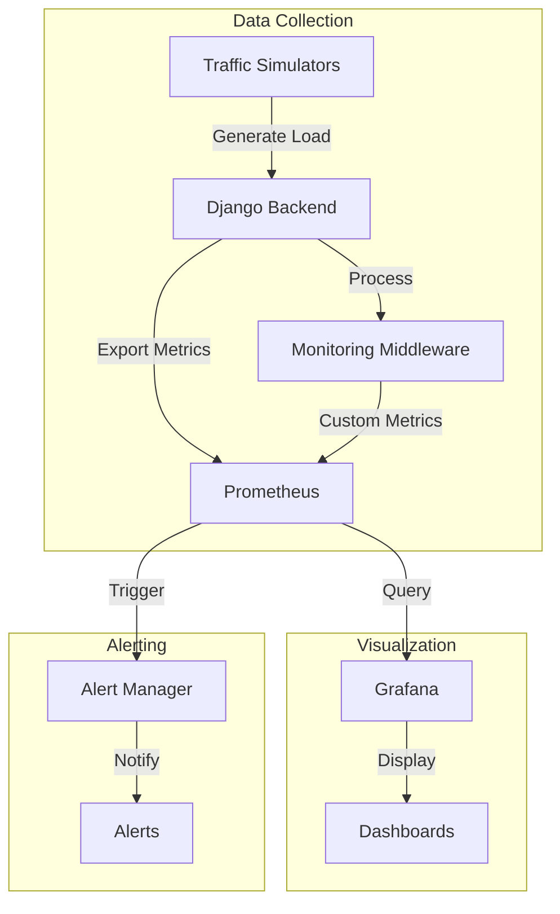
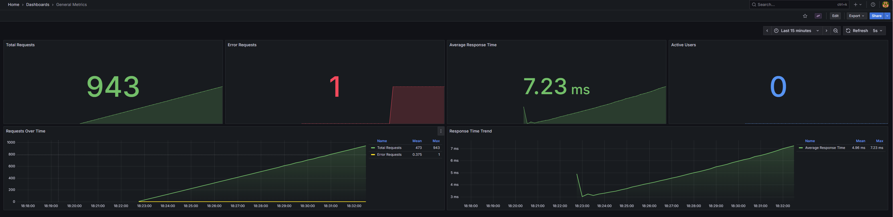
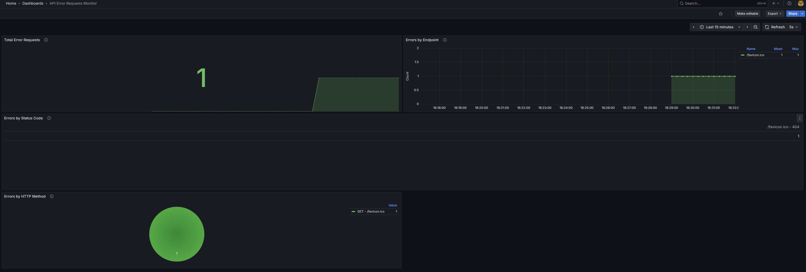
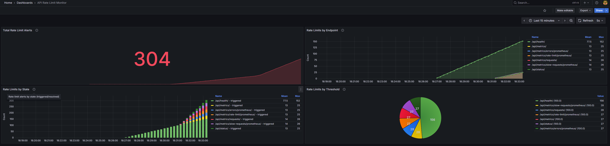
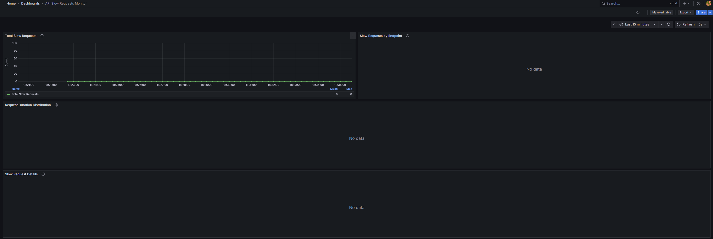
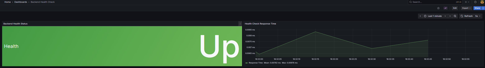
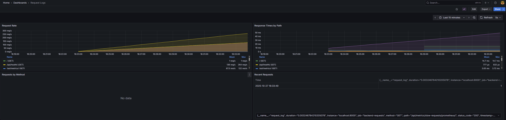
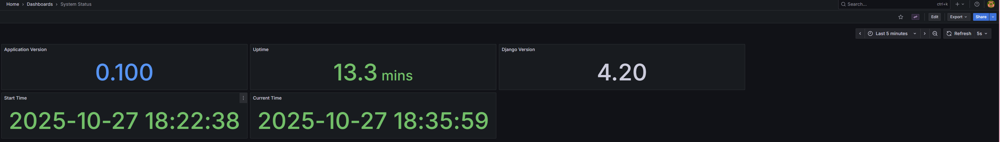

# Monitoring Stack Documentation

## Overview

This monitoring solution provides end-to-end observability for the task management system, featuring:

### Core Components
- **Prometheus**: Metrics collection and storage
- **Grafana**: Visualization and dashboards
- **Custom Middleware**: Advanced request tracking

### Key Features
- Real-time performance monitoring
- Comprehensive error tracking
- Rate limit monitoring
- Health checks and alerts
- Custom dashboard suite

### Quick Access
```bash
# Prometheus UI
http://<domain>:9090

# Grafana Dashboards
http://<domain>:3000
Default credentials: admin/admin
```

## System Architecture



### Data Flow
1. Backend generates metrics
2. Middleware processes and enriches data
3. Prometheus collects and stores metrics
4. Grafana queries and visualizes data
5. Alert Manager handles notifications

## Dashboard Suite

### 1. Overview Dashboard


| Feature | Description | Use Case |
|---------|-------------|----------|
| Request Overview | Total requests, error rate, avg response time | System health at a glance |
| User Activity | Active users, request patterns | User behavior analysis |
| Performance Trends | Response time trends, throughput | Capacity planning |

```bash
# Access URL
http://<domain>:3000/d/general_metrics

# Quick PromQL Examples
# Total Request Rate
rate(http_requests_total[5m])

# Error Rate
rate(http_requests_total{status=~"5.*"}[5m])
```

### 2. Error Tracking Dashboard


| Metric | Alert Threshold | Response |
|--------|----------------|----------|
| Error Rate | >5% | Warning |
| Error Rate | >10% | Critical |
| 5xx Errors | >10/min | Page On-Call |

```bash
# Access URL
http://<domain>:3000/d/error_requests

# Key Metrics
- Error rate by endpoint
- Status code distribution
- Error patterns
```

### 3. Rate Limiting Dashboard


**Purpose**: Tracks API rate limiting and throttling.

**Panels**:
- Total rate limit alerts
- Rate limits by endpoint
- Rate limits by state
- Rate Limit by threshold

**Use Cases**:
- API abuse prevention
- Capacity management
- User behavior analysis

### 4. Slow Requests Dashboard


**Purpose**: Identifies and analyzes performance bottlenecks.

**Panels**:
- Total slow requests
- Slow requests by endpoint
- Request duration distribution
- Slow request details

**Use Cases**:
- Performance optimization
- SLA monitoring
- Resource bottleneck identification

### 5. Health Check Dashboard


**Purpose**: Monitors system health and availability.

**Panels**:
- Backend health status
- Health check response time

**Use Cases**:
- System availability monitoring
- Proactive issue detection
- SLA compliance tracking

### 6. Request Logs Dashboard


**Purpose**: Detailed request logging and analysis.

**Panels**:
- Request rate
- Response times by path
- Requests by method
- Recent requests

**Use Cases**:
- User behavior analysis
- Debugging
- Audit trail monitoring

### 7. System Status Dashboard


**Purpose**: Infrastructure and system metrics.

**Panels**:
- Application version
- Uptime
- Django version
- Start time
- Current time

**Use Cases**:
- Resource utilization monitoring
- Capacity planning
- Infrastructure health

## Monitoring Approach

### 1. Multi-Layer Monitoring
- **Application Layer**: Request/response metrics, errors, performance
- **Business Layer**: Task creation/completion rates, user activity
- **Infrastructure Layer**: System resources, network

### 2. Key Metrics

#### Performance Metrics
- Request Duration (p50, p90, p95, p99)

#### Business Metrics
- Active Users
- Task Completion Rate
- API Usage Patterns
- Error Rates
- User Satisfaction (response times)

#### Infrastructure Metrics
- System Load
- Network I/O

### 3. Alerting Strategy

#### Critical Alerts
- Service Down
- Error Rate Spike
- High Response Time
- Resource Exhaustion
- Rate Limit Exceeded

#### Warning Alerts
- Elevated Error Rates
- Slow Response Time
- High Resource Usage
- Low Cache Hit Rate
- Unusual Traffic Patterns

### 4. Data Retention

- **Metrics**: 15-day retention
- **High-Resolution Data**: 24 hours
- **Aggregated Data**: 15 days
- **Dashboard Snapshots**: 30 days

## Implementation Guide

### Quick Start
```bash
# 1. Start the monitoring stack
docker-compose up -d

# 2. Verify services
curl http://<domain>:9090/-/healthy  # Prometheus
curl http://<domain>:3000/api/health # Grafana

# 3. Access UIs
open http://<domain>:9090  # Prometheus
open http://<domain>:3000  # Grafana
```

### Prometheus Setup

```yaml
# prometheus.yml
global:
  scrape_interval: 15s
  evaluation_interval: 15s

scrape_configs:
  - job_name: 'django'
    metrics_path: '/metrics'
    static_configs:
      - targets: ['backend:8000']
    scrape_interval: 15s
    scrape_timeout: 10s

  - job_name: 'prometheus'
    static_configs:
      - targets: ['<domain>:9090']
```

### Metric Types & Examples

#### 1. Counters (Increasing Values)
```python
# Python Implementation
requests_total = Counter(
    'http_requests_total',
    'Total HTTP requests',
    ['method', 'endpoint', 'status']
)

# PromQL Query
rate(http_requests_total[5m])
```

#### 2. Gauges (Current Values)
```python
# Python Implementation
active_users = Gauge(
    'active_users_total',
    'Current number of active users'
)

# PromQL Query
active_users_total
```

#### 3. Histograms (Distributions)
```python
# Python Implementation
request_duration = Histogram(
    'http_request_duration_seconds',
    'HTTP request duration',
    ['endpoint']
)

# PromQL Query
histogram_quantile(0.95, 
    rate(http_request_duration_seconds_bucket[5m])
)
```

## Dashboard Development

### Best Practices
1. Consistent layout and design
2. Clear panel titles and descriptions
3. Appropriate time ranges
4. Useful default views
5. Performance-optimized queries
6. Informative tooltips
7. Proper unit formatting

### Query Optimization
- Use rate() for counters
- Appropriate time intervals
- Efficient label matching
- Calculated fields
- Pre-aggregation where possible

## Continuous Improvement

### Monitoring Evolution
1. Regular dashboard reviews
2. Metric relevance assessment
3. Alert threshold adjustments
4. Performance optimization
5. User feedback incorporation

### Future Enhancements
1. Enhanced log correlation
2. Machine learning for anomaly detection
3. Business metric correlation
4. Custom metric development
5. Advanced visualization techniques
